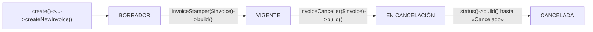

# Mapa funcional — laravel-factura-mx

> Todo lo que hace el paquete y con qué método se usa. CFDI 4.0 · PAC Finkok · v2.
> Punto de entrada: facade `JiagBrody\LaravelFacturaMx\Facades\LaravelFacturaMx`.

## El ciclo de vida de una factura

El borrador nace sellado con el CSD del emisor y validado localmente. La aceptación de una
cancelación no es inmediata (el SAT puede requerir aceptación del receptor): se consulta el
estatus hasta ver «Cancelado».

---

## 1 · Crear borrador — `LaravelFacturaMx::create()`

- **Tipos de comprobante**
  - `->ingreso()->custom($company)` — factura de ingreso
  - `->egreso()->custom($company)` — nota de crédito
  - `->recepcionDePagos()->custom($company)` — complemento de pago (REP 2.0)
- **Armado fluido** (ingreso / egreso → `GenericCreator`)
  - `->addAtributos(ComprobanteAtributos)` — serie, folio, forma/método de pago, moneda…
    La `Fecha` tiene default: *ahora*, en `default_timezone` (México). Sobreescribible con `setFecha()`.
  - `->addReceptor(ReceptorAtributos)`
  - `->addConceptos(Collection<ConceptoAtributos>)` — cada concepto con sus
    `ImpuestoTrasladoAtributos` / `ImpuestoRetenidoAtributos`
  - `->addRelacionados(Collection<CfdiRelacionadosAtributos>)` — relación con otros CFDI
    (sustitución, nota de crédito → TipoRelacion `01`/`03`…)
  - `->addComplementoImpuestosLocales($taxes)` — retenciones/traslados locales
- **Extras del REP** (→ `PagoCreator`)
  - `->addPay(array)` · `->addDoctoRelacionadoToPay($pay, array)` — calcula los ImpuestosDR
    prorrateados a partir del CFDI origen
- **Cierre**
  - `->build()` — **valida localmente** (XSD + reglas SAT vía cfdiutils, toggle `pre_validate_cfdi`)
    y **sella con el CSD**; lanza `CfdiPreValidationException` con la lista de errores si no pasa
  - `->build(validate: false)` — build **provisional** sin validación local, para vistas previas
    con datos aún incompletos (p. ej. receptor pendiente); el build final sí debe validar
  - `->createNewInvoice()` — persiste el borrador (estatus BORRADOR)

## 2 · Timbrar — `LaravelFacturaMx::invoiceStamper($invoice)->build()`

- **Guards previos** (protección)
  - Anti doble timbrado: si ya tiene CFDI → `InvoiceAlreadyStampedException`
  - Ventana SAT de 72 h del borrador (`stamp_draft_max_age_hours`) → `StaleCfdiDraftException`
  - XML de borrador existente y no vacío → `InvoiceDocumentMissingException`
- **Normaliza los estados reales de Finkok** (verificados empíricamente, ver tests de contrato)
  - Timbrado directo exitoso
  - Error 307 «timbre previo» → recupera el resultado original vía la operación `stamped`
    (el UUID de nivel superior de esa respuesta es el *WorkProcessId*, no el fiscal)
  - Cola asíncrona («recibido satisfactoriamente» sin XML) → reintenta `stamped` hasta el
    resultado final; si no llega → `PacStampInProgressException`
- **Persistencia integrada** (opcional, config `persist_stamp_result`)
  - `true` (default): estatus VIGENTE + registro `InvoiceCfdi` (UUID) + XML timbrado + PDF +
    borra los borradores — todo en la misma llamada
  - `false`: solo regresa la respuesta; la app anfitriona persiste con su propia orquestación
- **Respuesta** `PacStampResponse`
  - `getCheckProcess()` · `getUuid()` · `getXml()` · `getCodEstatus()`
  - `getIncidenciaCodigoError()` · `getIncidenciaMensaje()` — las incidencias también quedan
    en la tabla `invoice_incidents`
- El timbrado es **agnóstico del tipo**: sirve igual para ingreso, nota de crédito y REP.

## 3 · Cancelar — `LaravelFacturaMx::invoiceCanceller($invoice)`

- **Motivo SAT** con `->setCancelTypeEnum(InvoiceCfdiCancelTypeEnum::…)`

  | Enum | Motivo SAT | Nota |
  |---|---|---|
  | `NEW_WITH_ERRORS_RELATED` | 01 — con errores, con relación | Requiere `->setReplacementInvoiceCfdi($cfdi)` (la sustituta) |
  | `NEW_WITH_ERRORS_UNRELATED` | 02 — con errores, sin relación | |
  | `NEW_NOT_EXECUTED` | 03 — no se llevó a cabo la operación | |
  | `NEW_NORMATIVE_TO_GLOBAL` | 04 — operación nominativa en global | |

- **Ejecución** `->build()` → `PacCancelResponse`
  - `201` aceptada → persiste el **acuse** como documento del recibo de cancelación
  - `202` «previamente cancelado» → éxito idempotente, sin acuse nuevo
  - Rechazo → incidente registrado + `estatusCancelacion` con el motivo
- Aplica a los tres tipos de comprobante. La aceptación puede quedar pendiente del receptor:
  vigilar con la rama 4.

## 4 · Consultar estatus en el SAT — `LaravelFacturaMx::status()`

- **Parámetros**
  - `->setInvoice($invoice)`
  - `->setReceptorRfc('XAXX010101000')`
  - `->setTotal('612.90')` — el total **exacto** impreso en el CFDI (string recomendado)
- **Respuesta** `->build()` → `PacStatusResponse`
  - `estado` (Vigente / Cancelado / No Encontrado) · `esCancelable` · `estatusCancelacion`
  - `validacionEFOS` + `detallesValidacionEFOS` (listas negras 69-B)
  - `invoiceStatusEnum` — enum local, o `null` si el estado del SAT no tiene equivalente
    (**nunca** asume borrador)

## 5 · Recuperar un XML timbrado — `LaravelFacturaMx::RecoveryCfdiXmlFile()`

- **Cascada** `->setInvoice($invoice)->build()`
  1. `get_xml` del PAC por UUID
  2. Si responde «UUID no existe» → operación `stamped` con el XML de borrador
  3. Sin resultado → `notFound` limpio (no excepción)
- **Respuesta** `PacRecoveryCfdiXmlResponse`: `getCheckProcess()` · `getXml()`
- Pensada para el peor momento: factura timbrada cuyos archivos locales fallaron.
  El PAC resguarda el XML ~3 meses.

## 6 · Documentos XML / PDF — `LaravelFacturaMx::documentService()`

- **Lectura** — tras `->setInvoice($invoice)`
  - `getXmlFile()` / `getPdfFile()` · `getXmlUrl()` / `getPdfUrl()`
  - `getXmlArray()` / `getXmlObject()` — el CFDI parseado (vía phpcfdi/cfdi-to-json)
  - `getCancelReceiptDocuments()` — acuses de cancelación
- **Escritura**
  - `createXmlDocument(...)` · `createPdfDocumentFromXmlFile(...)` · `regenerateAndSaveInvoicePdf(...)`
- **PDF legible**
  - Vista Blade configurable (`pdf_invoice_view`; para personalizar: copia la default con otro
    nombre y apunta el config a ella) con **QR oficial de verificación del SAT**, cantidad con
    letra y datos del timbre
  - Generación automática al timbrar desactivable (`generate_pdf_on_stamp`)
  - Disco/carpeta por config (`filesystem_disk` — default privado, los CFDI llevan datos personales)

## 7 · Catálogos SAT 4.0 — `LaravelFacturaMx::getCatalogService()` / `SatCatalogsService::…`

- Base SQLite de **solo lectura** con los catálogos oficiales (conexión `sqlite-sat-catalogs`,
  independiente del motor principal de la app)
- Ejemplos: `SatCatalogsService::getClaveUnidad(filterByIds: [...])`,
  `SatCatalogsService::getObjetoImpuesto()`, régimen fiscal, usos CFDI, formas y métodos de
  pago, monedas, impuestos, tipos de relación…
- Ideales para llenar selects del frontend con valores válidos ante el SAT.

## 8 · Lecturas de base de datos — `LaravelFacturaMx::read()`

- `->setInvoice($invoice)` prepara ambos servicios a la vez:
  - **databaseService** — datos aplanados con joins
    (factura ⋈ tipos ⋈ estatus ⋈ empresa ⟕ CFDI ⟕ cancelaciones), con consultas
    especializadas de ingresos, incidentes y relaciones. Portable MySQL / PostgreSQL.
  - **documentService** — el de la rama 6, ya apuntando a la factura.

---

## Cobertura por tipo de comprobante

| Comprobante | Crear | Timbrar | Cancelar | PDF del paquete |
|---|:-:|:-:|:-:|:-:|
| Ingreso (factura) | ✓ | ✓ | ✓ | ✓ |
| Egreso (nota de crédito) | ✓ | ✓ | ✓ | ✓ |
| Pago (REP 2.0) | ✓ | ✓ | ✓ | — (lo genera la app anfitriona) |

## Excepciones tipadas

Todas heredan de `FacturaMxException` (un solo `catch` cubre el paquete). Nunca se usa
`abort()`: seguro en colas y comandos.

| Excepción | Cuándo |
|---|---|
| `PacConnectionException` | Fallo de red/SOAP con el PAC — **reintentable** sin duplicar timbres |
| `PacStampInProgressException` | El PAC sigue procesando (asíncrono) — reintenta en unos segundos |
| `InvoiceAlreadyStampedException` | Se evitó un doble timbrado |
| `StaleCfdiDraftException` | Borrador fuera de la ventana de 72 h — regenerar el CFDI |
| `CfdiPreValidationException` | No pasó la validación local; incluye la lista de errores |
| `InvoiceNotStampedException` | La operación requiere una factura timbrada |
| `InvoiceDocumentMissingException` | Falta el XML de borrador (registro o archivo físico) |
| `PacUnexpectedResponseException` | Respuesta con estructura desconocida — revisar el log SOAP |
| `UnknownPacProviderException` | `pac_chosen` apunta a un proveedor no implementado |

## Config esencial

| Clave | Qué controla |
|---|---|
| `pac_environment_production` | Demo o producción (URLs oficiales de Finkok incluidas) |
| `persist_stamp_result` | El paquete persiste al timbrar (`true`) o la app manda (`false`) |
| `generate_pdf_on_stamp` · `pdf_invoice_view` | PDF automático al timbrar y su vista Blade |
| `pre_validate_cfdi` | Validación local antes de enviar al PAC |
| `stamp_draft_max_age_hours` | Guard de la ventana de 72 h (0 = desactivado) |
| `pac_soap_timeout_seconds` | Timeout de cada llamada SOAP |
| `sat_files_path` | CSD de los emisores (carpeta NO pública) |
| `sat_local_resource_path` | XSD/XSLT del SAT (se descargan solos la primera vez) |
| `filesystem_disk` · `invoices_files_path` | Destino de XML/PDF (default privado) |
| `table_names` | Prefijo de tablas — configurable solo antes de migrar |
| `sqlite-sat-catalogs` | Ruta de la base SQLite de catálogos |

## Observabilidad

Cada operación SOAP queda registrada en `storage/logs/cfdi_finkok_*.log` (request y response,
**con la contraseña del PAC redactada**), incluso cuando la llamada falla. Los comportamientos
no documentados de Finkok (307, asíncrono, recuperación) están fijados con respuestas reales
grabadas en `tests/Unit/PacProviders/FinkokStampContractTest.php`.
